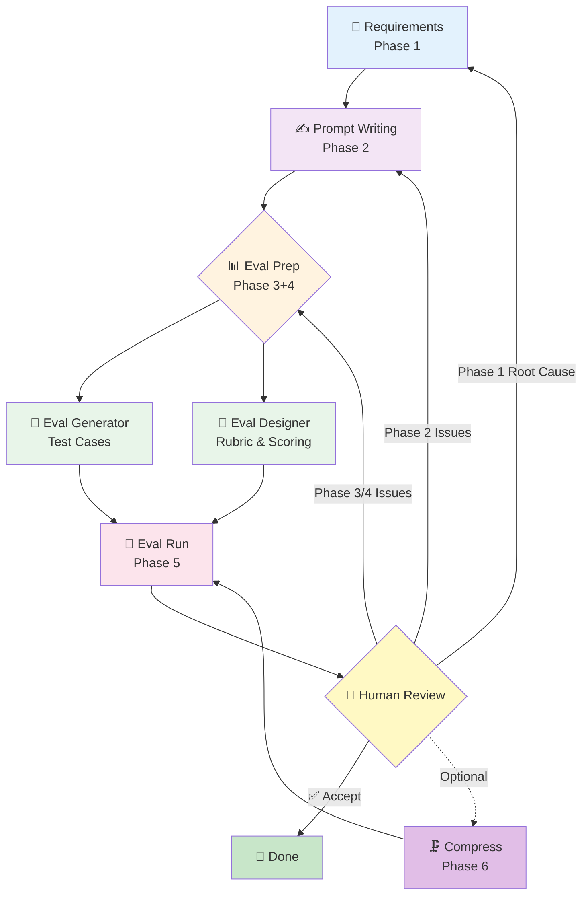

# Prompt Pilot — Prompt Engineering Framework

[](README.md) [](README_CN.md)

**Prompt Pilot** is a systematic framework for prompt engineering that transforms vague requirements into production-ready AI agents through rigorous evaluation and iteration. Unlike ad-hoc prompt writing, Prompt Pilot treats prompts as software products: starting from clear PRDs, generating comprehensive test suites, running automated evaluations, and iterating based on data-driven feedback—all within your CLI or Claude Code environment.

> Transform prompt requirements from vague ideas into evaluable, iterable, and deliverable products.

---

## What is Prompt Pilot?

Prompt Pilot is a pure CLI / Claude Code tool that standardizes prompt engineering:

- Start with requirement clarification, transforming vague ideas into complete PRDs
- Write high-quality prompts without missing constraints and boundaries
- Generate comprehensive evaluation sets and design scientific scoring standards
- Automatically run evaluations and produce detailed reports with Good/Bad cases
- Iterate based on evaluation feedback until targets are met

All prompt project files are written to `Prompts_Repo/<prompt_id>/`, separated from core Harness rules.

---

## Workflow



### Phase 1: Requirements Clarification
**Agent**: Requirements Clarifier

Dialogue with users to transform vague requirements into a structured PRD (Product Requirements Document):
- Role definition and objectives
- Capability boundaries and red lines
- Primary/secondary requirement breakdown
- Behavioral guidelines
- Output format and style
- Typical examples
- Success criteria

### Phase 2: Prompt Writing
**Agent**: Prompt Writer

Write high-quality prompts based on the PRD:
- Choose appropriate structure (System Prompt / Single-shot / Few-shot / Chained)
- Precise instructions, unambiguous constraints
- Format locking, template-driven
- Tone and role setting

### Phase 3+4: Evaluation Preparation (Parallel)
**Agents**: Eval Generator + Eval Designer

- **Eval Generator**: Generate comprehensive test case sets based on PRD
- **Eval Designer**: Design Rubric checkpoints and overall quality scoring standards

The two are independent and dispatched in parallel by the Orchestrator.

### Phase 5: Evaluation Execution
**Agent**: Eval Runner

Call model APIs to run the complete evaluation set:
- Execute test cases one by one
- Auto-score according to Rubric
- Generate evaluation reports with Good/Bad cases
- Output Agent iteration instructions

### Review: Human Decision and Iteration
**Orchestrator**: Present report + Root cause aggregation + Recommend iteration route

Based on failure pattern distribution in the evaluation report, recommend iteration priority:
1. Has Phase 1 root cause → Return to requirements clarification (requirement defects make prompt iteration futile)
2. Has Phase 3/4 root cause → Fix evaluation (unreliable evaluation makes all diagnoses unreliable)
3. Only Phase 2 root cause → Iterate prompt
4. Only model boundary / accept → Report prompt is ready, decision: change model or accept

### Phase 6: Prompt Compression (Optional)
**Agent**: Prompt Compressor

Simplify prompt length without changing core behavior, then re-run evaluation.

### Phase 7: Publishing
**Agent**: Prompt Publisher

After acceptance, publish the prompt to Prompt Library:
- Version management (Semantic Versioning SemVer)
- Generate Changelog
- Publish to `Prompts_Library/<category>/<prompt_id>/`
- Update global index and project registry

Categories: assistant, analyzer, generator, classifier, extractor, transformer

---

## Project Structure

Complete file structure for each prompt project:

```text
Prompts_Repo/<prompt_id>/
  .ph/
    project.json          # Project metadata
  docs/
    prd.md                # Prompt PRD (Phase 1 output)
    eval-rubric.md        # Evaluation framework (Phase 4 output)
  prompt.md               # Current version prompt (Phase 2 output)
  eval/
    eval-set.json         # Evaluation set (Phase 3 output)
    results/
      <run-id>.json       # Each evaluation result (Phase 5 output)
  REVIEW.md               # Current pending human tasks (HITL protocol)
```

Git manages `prompt.md` versions, with each iteration in a new commit.

---

## Core Design Principles

### HITL (Human-in-the-Loop) Protocol

At each checkpoint, three things must be done:
1. Refresh `REVIEW.md` so humans know where they are at a glance
2. Clearly state where to look and what to focus on
3. Clearly state how to provide feedback and what to respond when done

Don't just say "please confirm"—humans need guidance, not interrogation.

### Upstream Root Cause Priority

Don't repeatedly polish prompts when requirements are vague. Without solving upstream root causes, downstream iteration is wasted effort.

### Path Gating

Before writing any file, verify the path is within `Prompts_Repo/<active_prompt_id>/`.

Core rules are maintained only in `prompt-harness/`, with `.claude/` serving as entry adaptation only.

---

## Agent List

| Agent | Responsibility | File |
|-------|----------------|------|
| Requirements Clarifier | Requirement clarification, PRD writing | [requirements-clarifier.md](agents/requirements-clarifier.md) |
| Prompt Writer | Prompt writing and iteration | [prompt-writer.md](agents/prompt-writer.md) |
| Eval Generator | Evaluation set generation | [eval-generator.md](agents/eval-generator.md) |
| Eval Designer | Evaluation framework design | [eval-designer.md](agents/eval-designer.md) |
| Eval Runner | Evaluation execution and reporting | [eval-runner.md](agents/eval-runner.md) |
| Prompt Compressor | Prompt compression | [prompt-compressor.md](agents/prompt-compressor.md) |
| Prompt Publisher | Version management and publishing | [prompt-publisher.md](agents/prompt-publisher.md) |

---

## Entry Protocol

For complete routing logic of Prompt Pilot, see: [router.md](router.md)
