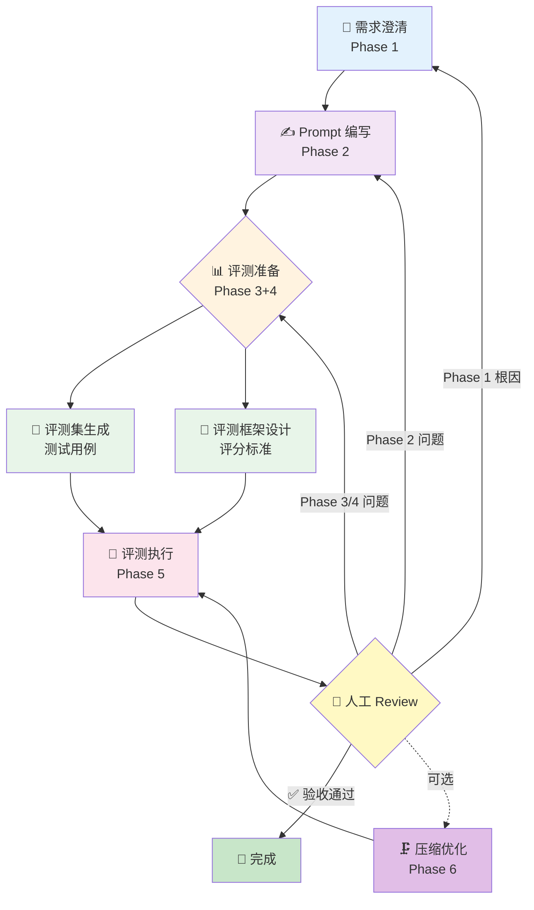

# Prompt Pilot — Prompt 工程化全流程工具

[](README.md) [](README_CN.md)

**Prompt Pilot** 是一套 Prompt 工程化框架，通过严谨的评测与迭代流程，将模糊的需求转化为生产级的 AI Agent。不同于临时性的 Prompt 编写，Prompt Pilot 将 Prompt 视为软件产品：从清晰的需求文档（PRD）开始，生成全面的测试集，执行自动化评测，并基于数据反馈进行迭代——全部在你的 CLI 或 Claude Code 环境中完成。

> 将 Prompt 需求从模糊想法工程化为可评测、可迭代、可交付的成品。

---

## 什么是 Prompt Pilot？

Prompt Pilot 是一个纯 CLI / Claude Code 工具，用于将 Prompt 工程规范化：

- 从需求澄清开始，把模糊想法转化为完整 PRD
- 编写高质量 Prompt，不遗漏约束和边界
- 生成覆盖全面的评测集，设计科学的评分标准
- 自动跑评测，生成含 Good/Bad case 的详细报告
- 基于评测反馈迭代优化，直至达标

所有 Prompt 项目文件写入 `Prompts_Repo/<prompt_id>/`，与 Harness 核心规则分离。

---

## 工作流程



### Phase 1: 需求澄清
**Agent**: Requirements Clarifier

与用户对话，将模糊需求转化为结构化的 PRD（产品需求文档）：
- 角色定义与目标
- 能力边界与红线
- 主需 / 次需拆分
- 行为准则
- 输出格式与风格
- 典型示例
- 成功标准

### Phase 2: Prompt 编写
**Agent**: Prompt Writer

根据 PRD 编写高质量 Prompt：
- 选择合适的结构（System Prompt / 单次任务 / Few-shot / 链式调用）
- 精确的指令，消歧的约束
- 格式锁定，模板驱动
- 语气与角色设定

### Phase 3+4: 评测准备（并行）
**Agents**: Eval Generator + Eval Designer

- **Eval Generator**：根据 PRD 生成覆盖全面的测试用例集
- **Eval Designer**：设计 Rubric 考点和整体质量评分标准

两者互不依赖，由 Orchestrator 并行调度。

### Phase 5: 评测执行
**Agent**: Eval Runner

调用模型 API 跑完整评测集：
- 逐条执行测试用例
- 按 Rubric 自动评分
- 生成含 Good/Bad case 的评测报告
- 输出 Agent 迭代指令

### Review: 人工决策与迭代
**Orchestrator**: 展示报告 + 根因聚合 + 推荐迭代路线

根据评测报告的失效模式分布，推荐迭代主线：
1. 有 Phase 1 根因 → 回需求澄清（需求缺陷，改 Prompt 徒劳）
2. 有 Phase 3/4 根因 → 修评测（评测不可信，其他诊断不可信）
3. 仅 Phase 2 根因 → 迭代 Prompt
4. 仅模型边界 / 接受 → 报告 Prompt 已到位，决策换模型或接受

### Phase 6: Prompt 压缩（可选）
**Agent**: Prompt Compressor

在不改变核心行为的前提下精简 Prompt 长度，完成后重跑评测。

### Phase 7: 发布入库
**Agent**: Prompt Publisher

验收通过后，将 Prompt 正式发布到 Prompt Library：
- 版本号管理（语义化版本 SemVer）
- 生成 Changelog（变更记录）
- 发布到 `Prompts_Library/<category>/<prompt_id>/`
- 更新全局索引和项目注册表

支持分类：assistant、analyzer、generator、classifier、extractor、transformer

---

## 项目结构

每个 Prompt 项目的完整文件结构：

```text
Prompts_Repo/<prompt_id>/
  .ph/
    project.json          # 项目元数据
  docs/
    prd.md                # Prompt PRD（Phase 1 产物）
    eval-rubric.md        # 评测框架（Phase 4 产物）
  prompt.md               # 当前版本 Prompt（Phase 2 产物）
  eval/
    eval-set.json         # 评测集（Phase 3 产物）
    results/
      <run-id>.json       # 每次评测结果（Phase 5 产物）
  REVIEW.md               # 当前待人类处理事项（HITL 协议）
```

Git 对 `prompt.md` 做版本管理，每次迭代在新的 commit 里。

---

## 核心设计原则

### HITL（Human-in-the-Loop）协议

每个卡点必须做三件事：
1. 刷新 `REVIEW.md`，让人类一眼知道在哪里
2. 说清楚去哪里看、重点看什么
3. 说清楚怎么反馈、完成后回什么

不允许只说"请确认"——人类需要被引导，不是被询问。

### 上游根因优先

不要在需求模糊时反复打磨 Prompt。上游根因不解决，下游迭代都是空转。

### 路径守门

写入任何文件前，必须检查路径位于 `Prompts_Repo/<active_prompt_id>/`。

核心规则只维护在 `prompt-harness/`，`.claude/` 只做入口适配。

---

## 代理清单

| Agent | 职责 | 文件 |
|-------|------|------|
| Requirements Clarifier | 需求澄清，PRD 编写 | [requirements-clarifier.md](agents/requirements-clarifier.md) |
| Prompt Writer | Prompt 编写与迭代 | [prompt-writer.md](agents/prompt-writer.md) |
| Eval Generator | 评测集生成 | [eval-generator.md](agents/eval-generator.md) |
| Eval Designer | 评测框架设计 | [eval-designer.md](agents/eval-designer.md) |
| Eval Runner | 评测执行与报告 | [eval-runner.md](agents/eval-runner.md) |
| Prompt Compressor | Prompt 精简压缩 | [prompt-compressor.md](agents/prompt-compressor.md) |
| Prompt Publisher | 版本管理与发布入库 | [prompt-publisher.md](agents/prompt-publisher.md) |

---

## 入口协议

Prompt Pilot 的完整路由逻辑见：[router.md](router.md)
